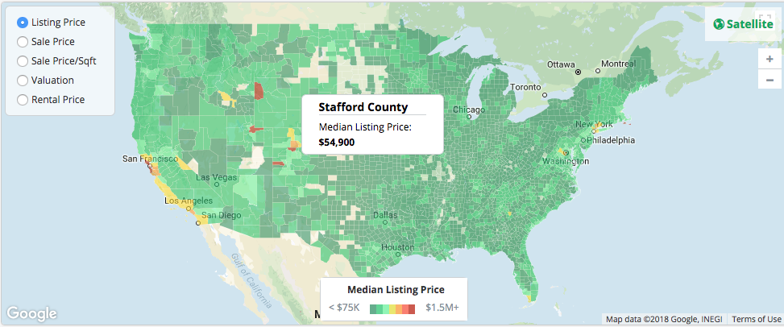
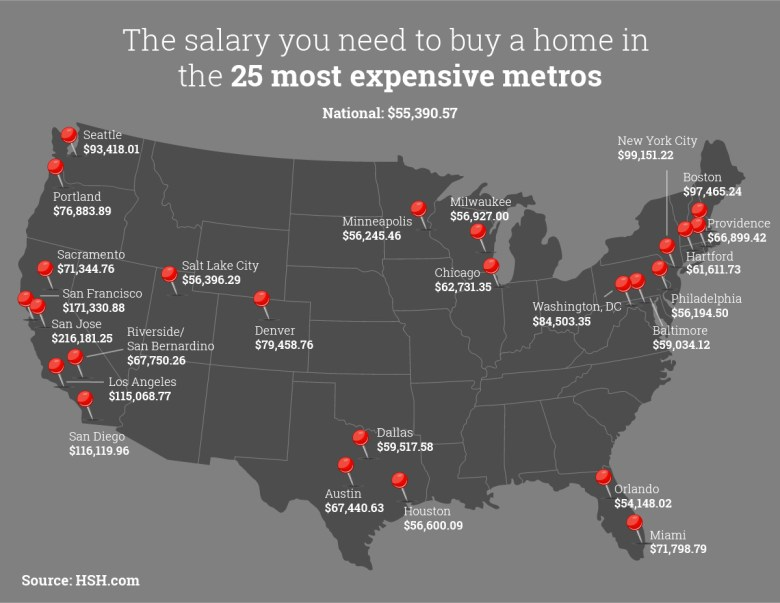
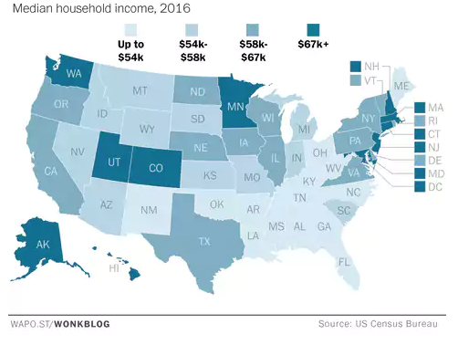

# Project 2: Housing Affordability Project #
- - - -

## Team Members ##
* Tommy Steed
* Patrick Dancel
* Christine Assaad
* Jungmyun Kim

## Project Proposal ##
This project visualizes the housing affordability by looking at the patterns between median housing prices, median income by male and female, and other factors.

## Data Used ##
We will be using data from multiple sources. Please see <https://github.com/pdancel/HousingProject> for more information.

## Inspiring ##

## GitHub ##
<https://github.com/pdancel/HousingProject>
